# UAMS — Class Diagram

**University Attendance Management System (UAMS)**

A desktop application built with **Python + CustomTkinter** (GUI), **SQLite** (storage via `sqlite3`), **bcrypt** (password hashing). The app follows a layered design:

- **Entry point** → `main.py`
- **Presentation layer** → `gui/*` (CustomTkinter windows/frames)
- **Persistence layer** → `database/db_manager.py` (single `DatabaseManager` class wrapping SQLite)
- **Utilities** → `utils/session.py`, `gui/theme.py`, `gui/icons.py`, `gui/scroll.py`, `gui/activity.py`

---

## 1. Diagram (Mermaid)

```mermaid
classDiagram
    direction LR

    class DatabaseManager {
        +str db_path
        +__init__(db_path=None)
        +get_conn() Connection
        +init_database()
        +close_all_connections()
        +authenticate(username, password) dict
        +change_password(user_id, old, new) bool
        +create_user(username, password, role, email) int
        +get_users(role=None) list
        +update_user(user_id, **kwargs)
        +delete_user(user_id)
        +add_department(...) int
        +get_departments() list
        +update_department(dept_id, **kwargs)
        +delete_department(dept_id)
        +add_student(...) int
        +get_students(search, dept_id, class) list
        +get_student(student_id) dict
        +update_student(sid, **kwargs)
        +delete_student(sid)
        +get_student_count() int
        +add_teacher(...) int
        +get_teachers(search, dept_id) list
        +get_teacher(teacher_id) dict
        +update_teacher(tid, **kwargs)
        +delete_teacher(tid)
        +get_teacher_count() int
        +add_course(...) int
        +get_courses(search, dept_id, teacher_id) list
        +update_course(cid, **kwargs)
        +delete_course(cid)
        +add_class(...) int
        +get_classes(dept_id, year) list
        +update_class(cid, **kwargs)
        +delete_class(cid)
        +add_student_to_class(class_id, student_id) bool
        +remove_student_from_class(class_id, student_id)
        +get_class_students(class_id) list
        +get_student_classes(student_id) list
        +take_attendance(student_id, course_id, date, status, ...) bool
        +get_attendance(...) list
        +update_attendance(att_id, status)
        +delete_attendance(att_id)
        +add_attendance_request(...) int
        +get_attendance_requests(status, student_id, course_ids) list
        +review_attendance_request(req_id, status, reviewer)
        +apply_attendance_request(req_id, reviewer) bool
        +get_attendance_summary(...) dict
        +get_today_attendance_stats(course_id, date) dict
        +get_attendance_trend(days, end_date) list
        +get_attendance_by_class(start, end) list
        +get_low_attendance_students(threshold, limit, teacher_id) list
        +get_department_stats() list
        +get_attendance_calendar(year, month) list
        +get_student_attendance_by_course(student_id) list
        +get_teacher_course_stats(teacher_id) list
        +get_teacher_attendance_stats(teacher_id, date) dict
        +get_teacher_attendance_trend(teacher_id, days) list
        +add_notification(student_id, type, message) int
        +get_notifications(student_id, status) list
        +get_setting(key) str
        +set_setting(key, value)
        +get_all_settings() dict
        +backup_database(path) bool
        +restore_database(path) bool
        +get_backup_logs() list
        +update_user_password(user_id, password)
        +get_user_by_username(username) dict
        +get_user(user_id) dict
        +link_student_user(student_id, user_id)
        +link_teacher_user(teacher_id, user_id)
        +log_activity(user_id, username, role, action, module, description)
        +get_activity_logs(...) list
        +get_log_modules() list
        +generate_low_attendance_notifications(threshold) list
    }

    class LoginWindow {
        +db: DatabaseManager
        +dashboard: DashboardWindow
        +username_entry
        +password_entry
        +show_password_var
        +error_label
        +__init__()
        +apply_theme()
        +login()
        +forgot_password()
        +_try_auto_login()
        +_build_sidebar()
        +_build_form()
        +_toggle_password_visibility()
    }

    class DashboardWindow {
        +parent: LoginWindow
        +user: dict
        +db: DatabaseManager
        +sidebar: Sidebar
        +frames: dict
        +current_view: str
        +__init__(parent, user)
        +show_frame(name)
        +apply_theme()
        +change_password()
        +logout()
        +on_close()
    }

    class Sidebar {
        +user: dict
        +nav_buttons: dict
        +__init__(parent, user, on_navigate, on_change_password, on_logout)
        +apply_theme()
        +build_ui()
        +set_active(name)
    }

    class SkeletonFrame {
        +__init__(master, fg_color, corner_radius)
        +start()
        +stop()
        +animate()
    }

    class ProgressBar {
        +float value
        +__init__(parent, value, color, height, radius)
        +set(value)
    }

    class _BaseDashboard {
        +user: dict
        +db: DatabaseManager
        +on_navigate
        +__init__(parent, user, db, on_navigate)
        +_show_skeleton()
        +_render_all()
        +_refresh()
        +_build_header()
        +_section_title()
        +_make_card()
        +_card_header()
        +_empty_state()
        +_stat_card()
    }

    class AdminDashboardView
    class TeacherDashboardView
    class StudentDashboardView
    class DashboardView {
        +__init__(user, db, parent, on_navigate)
        +show(view_name)
    }

    class BaseProfileView {
        +db: DatabaseManager
        +user: dict
        +dashboard
        +__init__(db, parent, user, dashboard)
        +_refresh()
        +_render()
        +_header_card()
        +_info_row()
    }

    class AdminProfileView
    class TeacherProfileView
    class StudentProfileView

    class StudentManagementView {
        +__init__(db, parent, user)
    }
    class TeacherManagementView {
        +__init__(db, parent, user)
    }
    class DepartmentManagementView {
        +__init__(db, parent, user)
    }
    class CourseManagementView {
        +__init__(db, parent, user)
    }
    class ClassManagementView {
        +__init__(db, parent, user)
    }
    class UserManagementView {
        +__init__(db, parent, user)
    }
    class AcademicYearView {
        +__init__(db, parent, user)
    }
    class AttendanceTakeView {
        +__init__(user, db, parent)
    }
    class AttendanceView {
        +__init__(db, parent, user)
    }
    class AttendanceRequestsView {
        +__init__(db, parent, user)
    }
    class ActivityLogView {
        +__init__(db, parent, user)
    }
    class ReportsView {
        +__init__(db, parent)
    }
    class SettingsView {
        +__init__(db, parent, window)
    }
    class BackupRestoreView {
        +__init__(db, parent)
    }
    class ScheduleView {
        +__init__(db, parent)
    }
    class NotificationsView {
        +__init__(db, parent)
    }
    class AboutView {
        +__init__(db, parent)
    }
    class StudentSubjectsView {
        +__init__(db, parent, user)
    }
    class StudentReportView {
        +__init__(db, parent, user)
    }
    class TeacherClassesView {
        +__init__(db, parent, user)
    }
    class MyCoursesView {
        +__init__(db, parent, user)
    }

    LoginWindow --> DatabaseManager : owns
    LoginWindow --> DashboardWindow : opens
    DashboardWindow --> DatabaseManager : owns
    DashboardWindow --> Sidebar : composes
    DashboardWindow --> LoginWindow : returns on logout

    _BaseDashboard <|-- AdminDashboardView
    _BaseDashboard <|-- TeacherDashboardView
    _BaseDashboard <|-- StudentDashboardView
    DashboardView --> _BaseDashboard : dispatches

    BaseProfileView <|-- AdminProfileView
    BaseProfileView <|-- TeacherProfileView
    BaseProfileView <|-- StudentProfileView

    StudentManagementView --> DatabaseManager : uses
    TeacherManagementView --> DatabaseManager : uses
    DepartmentManagementView --> DatabaseManager : uses
    CourseManagementView --> DatabaseManager : uses
    ClassManagementView --> DatabaseManager : uses
    UserManagementView --> DatabaseManager : uses
    AcademicYearView --> DatabaseManager : uses
    AttendanceTakeView --> DatabaseManager : uses
    AttendanceView --> DatabaseManager : uses
    AttendanceRequestsView --> DatabaseManager : uses
    ActivityLogView --> DatabaseManager : uses
    ReportsView --> DatabaseManager : uses
    SettingsView --> DatabaseManager : uses
    BackupRestoreView --> DatabaseManager : uses
    ScheduleView --> DatabaseManager : uses
    NotificationsView --> DatabaseManager : uses
    AboutView --> DatabaseManager : uses
    StudentSubjectsView --> DatabaseManager : uses
    StudentReportView --> DatabaseManager : uses
    TeacherClassesView --> DatabaseManager : uses
    MyCoursesView --> DatabaseManager : uses
    DashboardView --> DatabaseManager : uses
    _BaseDashboard --> DatabaseManager : uses
    BaseProfileView --> DatabaseManager : uses

    DashboardWindow ..> StudentManagementView : instantiates
    DashboardWindow ..> TeacherManagementView : instantiates
    DashboardWindow ..> DepartmentManagementView : instantiates
    DashboardWindow ..> CourseManagementView : instantiates
    DashboardWindow ..> ClassManagementView : instantiates
    DashboardWindow ..> UserManagementView : instantiates
    DashboardWindow ..> AcademicYearView : instantiates
    DashboardWindow ..> AttendanceTakeView : instantiates
    DashboardWindow ..> AttendanceView : instantiates
    DashboardWindow ..> AttendanceRequestsView : instantiates
    DashboardWindow ..> ActivityLogView : instantiates
    DashboardWindow ..> ReportsView : instantiates
    DashboardWindow ..> SettingsView : instantiates
    DashboardWindow ..> StudentSubjectsView : instantiates
    DashboardWindow ..> StudentReportView : instantiates
    DashboardWindow ..> TeacherClassesView : instantiates
    DashboardWindow ..> MyCoursesView : instantiates
    DashboardWindow ..> AdminProfileView : instantiates
    DashboardWindow ..> TeacherProfileView : instantiates
    DashboardWindow ..> StudentProfileView : instantiates
    DashboardWindow ..> DashboardView : instantiates

    _BaseDashboard --> SkeletonFrame : shows
    DashboardWindow --> SkeletonFrame : via views
    _BaseDashboard --> ProgressBar : draws
```



---

## 2. Class Reference

### 2.1 Persistence Layer

#### `DatabaseManager` — `database/db_manager.py`

The **single data-access gateway**. Every GUI view receives an instance and calls its methods; no view talks to SQLite directly.

| Aspect | Detail |
|---|---|
| **Role** | CRUD + reporting over all SQLite tables |
| **Key attribute** | `db_path` — path to `uams.db` |
| **Setup** | `init_database()` creates 15 tables and runs idempotent migrations |

**Methods (grouped):**

| Group | Methods |
|---|---|
| Connection | `get_conn()`, `close_all_connections()` |
| Auth / users | `authenticate()`, `change_password()`, `create_user()`, `get_users()`, `update_user()`, `delete_user()`, `get_user()`, `get_user_by_username()`, `update_user_password()` |
| Departments | `add_department()`, `get_departments()`, `update_department()`, `delete_department()` |
| Students | `add_student()`, `get_students()`, `get_student()`, `update_student()`, `delete_student()`, `get_student_count()`, `get_student_by_user_id()` |
| Teachers | `add_teacher()`, `get_teachers()`, `get_teacher()`, `update_teacher()`, `delete_teacher()`, `get_teacher_count()`, `get_teacher_by_user_id()` |
| Courses | `add_course()`, `get_courses()`, `update_course()`, `delete_course()` |
| Classes | `add_class()`, `get_classes()`, `update_class()`, `delete_class()` |
| Class enrollment | `add_student_to_class()`, `remove_student_from_class()`, `get_class_students()`, `get_student_classes()` |
| Attendance | `take_attendance()`, `get_attendance()`, `update_attendance()`, `delete_attendance()`, `get_attendance_summary()`, `get_today_attendance_stats()` |
| Attendance requests | `add_attendance_request()`, `get_attendance_requests()`, `get_attendance_request()`, `review_attendance_request()`, `apply_attendance_request()` |
| Analytics | `get_attendance_trend()`, `get_attendance_by_class()`, `get_low_attendance_students()`, `get_department_stats()`, `get_attendance_calendar()`, `get_student_attendance_by_course()`, `get_teacher_course_stats()`, `get_teacher_attendance_stats()`, `get_teacher_attendance_trend()` |
| Notifications | `add_notification()`, `get_notifications()`, `generate_low_attendance_notifications()` |
| Settings | `get_setting()`, `set_setting()`, `get_all_settings()` |
| Backup / restore | `backup_database()`, `restore_database()`, `get_backup_logs()` |
| Audit | `log_activity()`, `get_activity_logs()`, `get_log_modules()` |
| Linking | `link_student_user()`, `link_teacher_user()` |

**Notable behaviour**
- `authenticate()` verifies passwords with **bcrypt** and stamps `last_login`.
- `take_attendance()` uses `INSERT OR REPLACE` keyed on `UNIQUE(student_id, course_id, attendance_date)`.
- `apply_attendance_request()` approves a Pending request by writing/updating the attendance record, then marks it Approved.
- `init_database()` is a full schema builder + migration runner (adds columns, rebuilds the `attendance` table when the status `CHECK` needs `Excused`, seeds the default admin and settings).

---

### 2.2 Application / Window Layer

#### `LoginWindow` — `gui/login.py` (extends `ctk.CTk`)

Application entry point. Renders the branded login screen, restores the saved theme, validates credentials and opens `DashboardWindow`.

- Key attributes: `db`, `dashboard`, `username_entry`, `password_entry`, `error_label`
- Methods: `login()`, `forgot_password()`, `_try_auto_login()` (silent session restore), `apply_theme()`
- On success: logs in, `save_session(...)`, hides itself and opens the dashboard.

#### `DashboardWindow` — `gui/dashboard.py` (extends `ctk.CTkToplevel`)

The main shell after login. Holds a `Sidebar` and swaps frames inside `content_frame` via `show_frame(name)`. Its `views` map (lines 66–90) resolves a view key to `(Class, constructor-args)`.

- Key attributes: `parent`, `user`, `db`, `sidebar`, `frames`, `current_view`
- Methods: `show_frame(name)`, `apply_theme()`, `change_password()`, `logout()`, `on_close()`
- Manages logout/close flow: logs the event, clears the session, returns to `LoginWindow`.

#### `Sidebar` — `gui/sidebar.py` (extends `ctk.CTkFrame`)

Navigation panel. Builds role-aware nav buttons from `NAV_ICONS`, highlights the active item and delegates navigation via callbacks injected by `DashboardWindow`.

---

### 2.3 Dashboards (`gui/dashboard_view.py`)

| Class | Extends | Purpose |
|---|---|---|
| `ProgressBar` | `tkinter.Canvas` | Reusable animated progress bar widget. |
| `_BaseDashboard` | `ctk.CTkFrame` | Shared dashboard base: skeleton loading, header/stat/card/empty-state builders, refresh. |
| `AdminDashboardView` | `_BaseDashboard` | Admin KPIs, charts, low-attendance warnings, department stats. |
| `TeacherDashboardView` | `_BaseDashboard` | Per-teacher stats: course cards, today's attendance, trend. |
| `StudentDashboardView` | `_BaseDashboard` | Personal attendance %, per-course breakdown, calendar heatmap. |
| `DashboardView` | `ctk.CTkFrame` | Dispatcher that instantiates the correct `*DashboardView` for the logged-in role. |

**Inheritance:**

```
DashboardView  (dispatcher)
   │  instantiates
   ▼
_BaseDashboard ──┬── AdminDashboardView
                 ├── TeacherDashboardView
                 └── StudentDashboardView
```

---

### 2.4 Profiles (`gui/profile.py`)

| Class | Extends | Purpose |
|---|---|---|
| `BaseProfileView` | `ctk.CTkFrame` | Shared profile layout: header card, avatar, info rows, attendance status chip. |
| `AdminProfileView` | `BaseProfileView` | Administrator profile. |
| `TeacherProfileView` | `BaseProfileView` | Teacher profile with linked courses/classes. |
| `StudentProfileView` | `BaseProfileView` | Student profile with attendance summary. |

---

### 2.5 Management & Feature Views

All views extend `ctk.CTkFrame` and take `(db, parent, user=None)` (with exceptions noted). Each is a full CRUD screen backed by `DatabaseManager`.

| Class | File | Signature | Responsibility |
|---|---|---|---|
| `StudentManagementView` | `student_management.py` | `(db, parent, user)` | Add/edit/delete & search students, assign photos. |
| `TeacherManagementView` | `teacher_management.py` | `(db, parent, user)` | Teacher records & user-account linking. |
| `DepartmentManagementView` | `department_management.py` | `(db, parent, user)` | Department CRUD. |
| `CourseManagementView` | `course_management.py` | `(db, parent, user)` | Course CRUD & teacher assignment. |
| `ClassManagementView` | `class_management.py` | `(db, parent, user)` | Class CRUD & enrollment management. |
| `UserManagementView` | `user_management.py` | `(db, parent, user)` | Users, roles, activation, password reset. |
| `AcademicYearView` | `academic_year_view.py` | `(db, parent, user)` | Academic year & active semester settings. |
| `AttendanceTakeView` | `attendance_view.py` | `(user, db, parent)` | Mark/take attendance per course. |
| `AttendanceView` | `attendance_view.py` | `(db, parent, user)` | Browse/filter attendance records. |
| `AttendanceRequestsView` | `attendance_requests_view.py` | `(db, parent, user)` | Review & approve/reject correction requests. |
| `ActivityLogView` | `activity_log_view.py` | `(db, parent, user)` | Audit-log explorer with filters. |
| `ReportsView` | `reports.py` | `(db, parent)` | Aggregated attendance reports. |
| `SettingsView` | `settings_view.py` | `(db, parent, window)` | University/settings + SMTP/SMS config, theme. |
| `BackupRestoreView` | `backup_restore.py` | `(db, parent)` | DB backup/restore with history. |
| `ScheduleView` | `schedule_view.py` | `(db, parent)` | Timetable/schedule view. |
| `NotificationsView` | `notifications_view.py` | `(db, parent)` | Email/SMS/warning notifications list. |
| `AboutView` | `about_view.py` | `(db, parent)` | App info. |
| `StudentSubjectsView` | `student_subjects_view.py` | `(db, parent, user)` | Student's subject list. |
| `StudentReportView` | `student_report_view.py` | `(db, parent, user)` | Per-student attendance report. |
| `TeacherClassesView` | `teacher_classes_view.py` | `(db, parent, user)` | Classes owned by the logged-in teacher. |
| `MyCoursesView` | `dashboard.py` | `(db, parent, user)` | Teacher's assigned courses. |

---

## 3. Relationships & Data Flow

```
main.py ──► LoginWindow ──► (auth OK) ──► DashboardWindow
                                           │  owns  │
                                      Sidebar      └─► show_frame(name)
                                                       │
                                          ┌────────────┼────────────┐
                                          ▼            ▼            ▼
                                   ManagementViews  Dashboards  ProfileViews
                                          │            │            │
                                          └──────► DatabaseManager ◄──┘
                                                          │
                                                       SQLite
                                                      (uams.db)
```

1. `main.py` starts `LoginWindow` and installs global mouse-wheel scrolling.
2. `LoginWindow` authenticates against `DatabaseManager.authenticate()` (bcrypt) and opens `DashboardWindow`.
3. `DashboardWindow.show_frame()` lazily builds the selected view inside `content_frame`.
4. Every view receives `db` (a `DatabaseManager`) and performs all persistence through it — views never touch SQL directly.
5. `Sidebar` triggers navigation through callbacks wired into `DashboardWindow`.

---

## 4. Database Schema (tables behind `DatabaseManager`)

`init_database()` creates/migrates these tables:

`users` · `students` · `teachers` · `departments` · `courses` · `classes` · `class_students` · `attendance` · `attendance_requests` · `notifications` · `academic_years` · `settings` · `backup_log` · `activity_logs`

**Key foreign keys**
- `students.department_id → departments.id`, `students.user_id → users.id`
- `teachers.department_id → departments.id`, `teachers.user_id → users.id`
- `courses.teacher_id → teachers.id`, `courses.department_id → departments.id`
- `classes.department_id → departments.id`, `classes.teacher_id → teachers.id`
- `class_students.class_id → classes.id` (CASCADE), `class_students.student_id → students.id` (CASCADE)
- `attendance.student_id → students.id`, `attendance.course_id → courses.id`, `attendance.class_id → classes.id`, `attendance.taken_by → users.id` — `UNIQUE(student_id, course_id, attendance_date)`
- `attendance_requests.student_id → students.id` (CASCADE), `course_id → courses.id`, `class_id → classes.id`, `reviewed_by → users.id`
- `notifications.student_id → students.id`

---

## 5. Module Utility Functions (non-class helpers)

| Module | Function | Purpose |
|---|---|---|
| `utils/session.py` | `save_session`, `load_session`, `clear_session` | Persist/restore/clear login session in `session.json`. |
| `gui/theme.py` | `set_mode(mode)`, `c(key)` | Apply light/dark theme and resolve color keys. |
| `gui/icons.py` | `icon(name, size)` | Load/cache PNG icons. |
| `gui/scroll.py` | `enable_mousewheel_scrolling(root)` | Global mouse-wheel scrolling for CTk scrollables. |
| `gui/activity.py` | `log(db, user, action, module, description)` | Write an audit-log entry (never raises). |
| `gui/skeleton.py` | `build_dashboard_skeleton`, `build_table_skeleton`, `schedule_table_load` | Skeleton loading UI helpers. |
