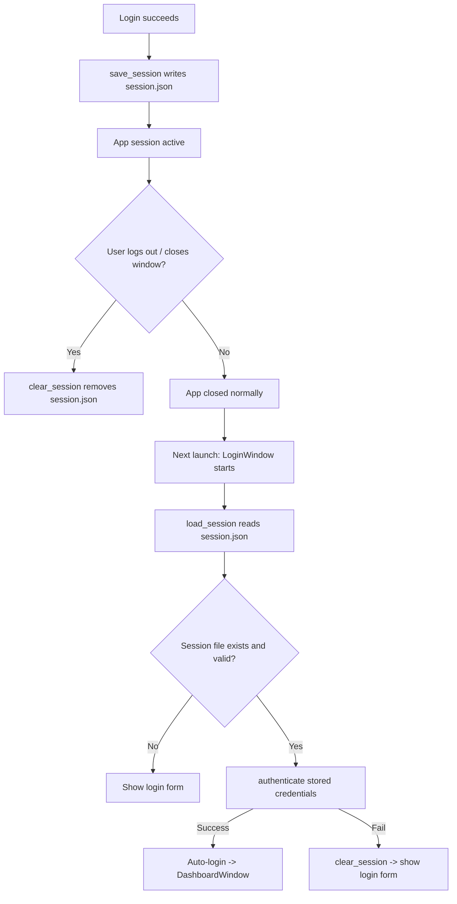

# UAMS — Session Workflow

How the application persists, restores, and clears the login session (`session.json`).

## 1. Overview

A session is a JSON file (`session.json`) in the project root that remembers the last logged-in user's credentials so the app can **auto-login** on the next launch.

| Aspect | Detail |
|---|---|
| File | `session.json` (project root) |
| Format | `{"username": "...", "password": "..."}` |
| Module | `utils/session.py` |
| Created by | Successful manual login (`save_session`) |
| Read by | Startup auto-login (`load_session`) |
| Removed by | Logout, window close, or failed auto-login (`clear_session`) |
| Git | Ignored via `.gitignore` |

## 2. Session Lifecycle



## 3. `utils/session.py`

### `SESSION_FILE`
```
SESSION_FILE = <project-root>/session.json
```
Resolved from the file's own location, so it works regardless of the current working directory.

### `save_session(username, password)`
- Writes `{"username": ..., "password": ...}` to `session.json`.
- Swallows `OSError` (e.g. permission issues) so a failed write never crashes the app.

### `load_session()`
- Reads and parses `session.json`.
- Returns the dict **only** if both `username` and `password` are non-empty.
- Catches `OSError` (missing file) and `ValueError` (malformed JSON) → returns `None`.

### `clear_session()`
- Deletes `session.json` if it exists.
- Swallows `OSError`.

## 4. Session Creation — Successful Login

In `gui/login.py` → `login()`:

1. Credentials pass `db.authenticate()`.
2. `save_session(username, password)` writes `session.json`.
3. Login window is hidden (`withdraw()`).
4. `DashboardWindow(self, user)` opens.

## 5. Session Restoration — Auto-Login at Startup

In `gui/login.py` → `_try_auto_login()` (called from `__init__`):

1. `load_session()` reads `session.json`.
2. **No session** → return, normal login form is shown.
3. **Session present** → `db.authenticate(session["username"], session["password"])`.
   - **Success** → log `LOGIN` (auto-session), hide login window, open `DashboardWindow`.
   - **Failure** (wrong/expired password, disabled account) → `clear_session()` and show the form.

## 6. Session Termination

Both paths in `gui/dashboard.py`:

| Trigger | Method | Result |
|---|---|---|
| "Logout" sidebar button | `logout()` | Log `LOGOUT`, `clear_session()`, destroy dashboard, restore login window |
| Closing the dashboard window | `on_close()` | Log `LOGOUT`, `clear_session()`, destroy dashboard, restore login window |

After `clear_session()`, the next launch shows the login form instead of auto-logging in.

## 7. Key Files

| File | Responsibility |
|---|---|
| `utils/session.py` | `save_session` / `load_session` / `clear_session` + `SESSION_FILE` path |
| `gui/login.py` | Creates session on login; reads/validates it for auto-login; clears on failure |
| `gui/dashboard.py` | Clears session on logout / window close |
| `session.json` | Persisted session data (gitignored) |

## 8. Security Notes

- `session.json` stores the **password in plaintext** to enable auto-login.
- The password is only used to re-run `authenticate()` (which checks the bcrypt hash) — it is never sent anywhere or stored in the database.
- Risk: anyone with filesystem access can read `session.json`. Mitigations: the file is gitignored, deleted on logout, and cleared automatically if the stored credentials no longer validate.
- Changing the user's password invalidates the stored session (auto-login then fails and the file is cleared).
