# UAMS — Attendance Request / Correction Flow

How a student requests a change to their attendance and staff approve or reject it.

## 1. Overview

A single view, `AttendanceRequestsView` (`gui/attendance_requests_view.py`), is used by **all three roles** — the UI adapts based on `user.role`.

| Role | Experience |
|---|---|
| Student | "My Attendance Requests" — can submit new requests, sees their own only |
| Teacher | Sees requests for their own courses, can approve/reject |
| Admin | Sees all requests, can approve/reject |

Lifecycle statuses: **Pending → Approved | Rejected** (`attendance_requests.status`).

## 2. Flowchart

```mermaid
flowchart TD
    subgraph Student side
        A[Student opens My Requests] --> B[Clicks + New Request]
        B --> C[Dialog: Course / Date / Type / Reason]
        C --> D{Valid course + date?}
        D -- No --> E[Validation error - stop]
        D -- Yes --> F[db.add_attendance_request - INSERT]
        F --> G[Status = Pending]
        G --> H[Log CREATE Attendance Request]
        H --> I[Success dialog - awaiting review]
    end

    subgraph Staff side
        J[Teacher/Admin opens Requests] --> K[Filter by Status default Pending]
        K --> L[Select a row in table]
        L --> M{Approve or Reject?}
        M -- Approve --> N{Still Pending?}
        M -- Reject --> P{Still Pending?}
        N -- No --> Q[Already Reviewed - stop]
        P -- No --> Q
        N -- Yes --> R[askyesno confirm]
        R -- Yes --> S[db.apply_attendance_request]
        S --> T[take_attendance Present/Excused]
        T --> U[review_attendance_request Approved]
        U --> V[Log UPDATE - Approved]
        P -- Yes --> W[askyesno confirm]
        W -- Yes --> X[db.review_attendance_request Rejected]
        X --> Y[Log UPDATE - Rejected]
        V --> Z[Reload table]
        Y --> Z
    end
```



## 3. Student Side — Submitting a Request

### `_new_request_dialog`
1. Resolves the logged-in student via `db.get_student_by_user_id(user["id"])`.
   - Not linked → error "Student profile not linked...".
2. Dialog fields:
   - **Course** (dropdown, pre-filtered to the student's department, falls back to all courses)
   - **Date** (defaults to today, `YYYY-MM-DD`)
   - **Request Type** — `Correction` (attended but not marked) or `Excused` (absence)
   - **Reason** (optional)
3. On **Submit**:
   - Validate course + date.
   - `db.add_attendance_request(student_id, course_id, request_date, request_type, reason)` → `INSERT`, returns `req_id`.
   - Success → log `CREATE`, success dialog, close dialog, reload.

## 4. Data Scoping

`_scope()` limits what each role sees:

| Role | Scope filter passed to `get_attendance_requests` |
|---|---|
| Student | `student_id` = their own |
| Teacher | `course_ids` = courses they teach |
| Admin | none (all) |

The status filter (default **Pending**) is applied on top.

## 5. Staff Side — Reviewing

### Approve (`_approve_selected`)
1. A row must be selected.
2. The request must still be `Pending` (already-reviewed rows are rejected with "Already Reviewed").
3. `askyesno` confirmation — explains attendance will be recorded.
4. `db.apply_attendance_request(req_id, reviewer_user_id)`:

   `apply_attendance_request` (`database/db_manager.py`):
   1. Loads the request; returns `False` if missing or not `Pending`.
   2. Computes target status: `Correction → Present`, `Excused → Excused`.
   3. Writes/updates the attendance row via `take_attendance(..., status=target, taken_by=reviewer, attendance_time=now)` (the `UNIQUE(student, course, date)` upsert).
   4. Marks the request `Approved` via `review_attendance_request`.
   5. Returns `True`.
5. On success → log `UPDATE`, success dialog, reload.

### Reject (`_reject_selected`)
1. Row selected, must be `Pending`.
2. `askyesno` confirmation.
3. `db.review_attendance_request(req_id, "Rejected", reviewer_user_id)` — updates `status`, `reviewed_by`, `reviewed_at`.
4. Log `UPDATE`, success dialog, reload.

> `review_attendance_request` (`database/db_manager.py`) is the shared status writer:
> ```sql
> UPDATE attendance_requests SET status=?, reviewed_by=?, reviewed_at=? WHERE id=?
> ```

## 6. Database — `attendance_requests` table

- `status` constrained to `Pending` / `Approved` / `Rejected` (default `Pending`).
- Tracks `reviewed_by` (user id) and `reviewed_at` (timestamp) for the audit trail.
- `student_id → students.id` with `ON DELETE CASCADE`.

## 7. Key Files

| File | Responsibility |
|---|---|
| `gui/attendance_requests_view.py` | Student submission + staff approve/reject UI, role scoping |
| `database/db_manager.py` | `add_attendance_request`, `get_attendance_requests`, `get_attendance_request`, `review_attendance_request`, `apply_attendance_request` |
| `gui/activity.py` | Audit logging (`CREATE` / `UPDATE`) |
