# UAMS — Backup & Restore Flow

How the SQLite database (`uams.db`) is backed up manually, on a schedule, and restored.

## 1. Overview

Backups are plain **file copies** of `uams.db` stored in the `backup/` directory and tracked in the `backup_log` table. There are two entry points:

| Entry point | Where | What |
|---|---|---|
| `BackupRestoreView` | `gui/backup_restore.py` | Dedicated view: manual backup, hourly auto-backup, restore |
| `SettingsView` | `gui/settings_view.py` | `backup_db()` / `restore_db()` buttons in System Settings |

Both call the same DB methods: `backup_database()`, `restore_database()`, `get_backup_logs()`.

## 2. Flowchart

```mermaid
flowchart TD
    subgraph Backup
        A[Create Backup Now or Auto Backup timer fires]
        A --> B[db.backup_database path]
        B --> C[shutil.copy2 uams.db -> backup/backup_*.db]
        C --> D[INSERT backup_log file_path]
        D --> E{Success?}
        E -- Yes --> F[Success dialog]
        E -- No --> G[Error dialog with reason]
        F --> H[Refresh backup history]
    end

    subgraph Restore
        I[Select Backup File and Restore] --> J[Choose .db via file dialog]
        J --> K[askyesno: overwrite all current data?]
        K -- No --> L[Cancel]
        K -- Yes --> M[db.restore_database path]
        M --> N{File exists?}
        N -- No --> O[Backup file not found]
        N -- Yes --> P[close_all_connections]
        P --> Q[shutil.copy2 backup -> uams.db]
        Q --> R[Success dialog - may need restart]
    end
```

## 3. Backup

### Manual (`create_backup`)
1. Filename: `backup_YYYYMMDD_HHMMSS.db` in the `backup/` directory (auto-created).
2. `db.backup_database(path)`:
   - `shutil.copy2(self.db_path, backup_path)` — copy the DB file.
   - `INSERT INTO backup_log (file_path) VALUES (?)` — record it.
   - Returns `True` on success or the error string on failure.
3. GUI shows success/error and reloads the history list.

### Auto backup (hourly)
In `BackupRestoreView`:
1. The `auto_backup` setting (`settings` table) is read on startup; if `"1"`, auto-backup is scheduled.
2. `schedule_auto_backup()` starts a `threading.Timer(3600, auto_backup_worker)` (daemon thread).
3. `auto_backup_worker` runs in the background:
   - Writes `auto_backup_YYYYMMDD_HHMMSS.db`.
   - Re-arms the timer in a `finally` block while the setting is still `"1"`.
4. Toggling the checkbox / "Save Setting" calls `set_setting("auto_backup", "0"|"1")`; toggling off cancels the timer (`cancel_auto_backup`).

> The same `auto_backup` setting is also written by `SettingsView.save_system`.

## 4. Restore

1. File dialog picks a `.db` backup (default folder = `backup/`).
2. **Destructive warning**: `askyesno("This will overwrite all current data. Continue?")` — hard stop unless confirmed.
3. `db.restore_database(path)`:
   - Returns `"Backup file not found"` if the file doesn't exist.
   - `close_all_connections()` releases any open connection.
   - `shutil.copy2(backup_path, self.db_path)` overwrites the live database.
   - Returns `True` or the error string.
4. Success → "Database restored. Some features may need a restart."

> **No undo.** A restore permanently replaces the current database. Backup before restoring if unsure.

## 5. Backup History

- `get_backup_logs()` → `SELECT * FROM backup_log ORDER BY created_at DESC`.
- `BackupRestoreView.load_logs()` renders each entry as `created_at - filename`.

## 6. Key Files

| File | Responsibility |
|---|---|
| `gui/backup_restore.py` | `BackupRestoreView` — manual backup, hourly auto timer, restore, history |
| `gui/settings_view.py` | `backup_db()` / `restore_db()` quick actions in Settings |
| `database/db_manager.py` | `backup_database()`, `restore_database()`, `get_backup_logs()`, `get_setting`/`set_setting`, `close_all_connections()` |
| `backup/` | Backup output directory (gitignored) |
