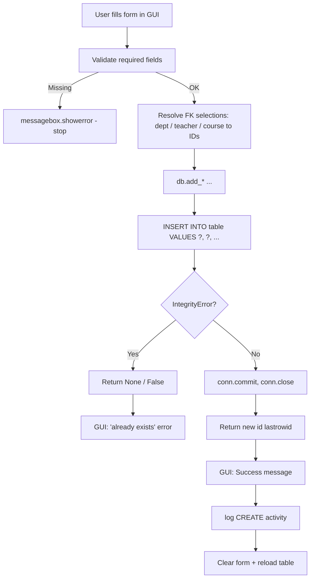
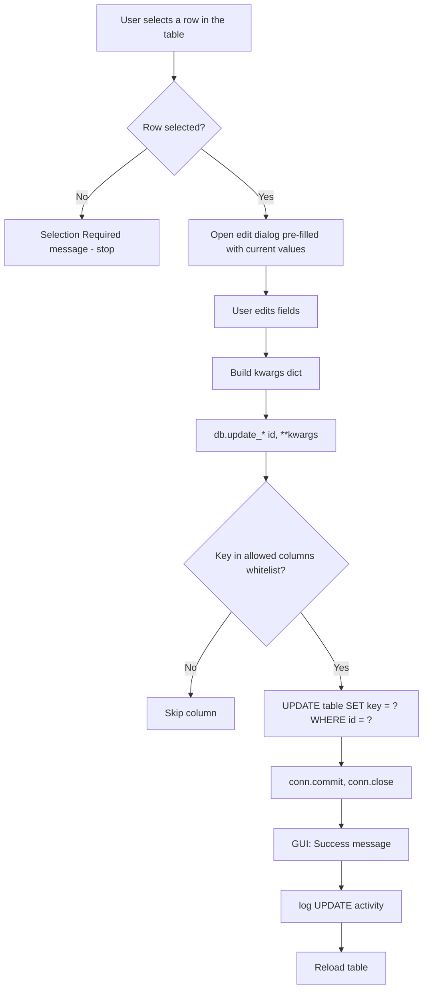
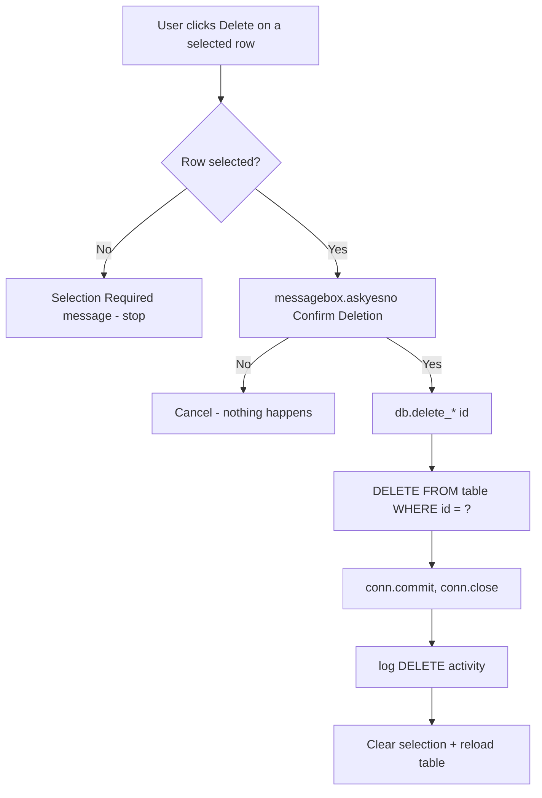

# UAMS — Insert / Update / Delete Flow

How the application creates, edits, and removes records in the SQLite database.

## 1. Overview

All write operations go through `DatabaseManager` in `database/db_manager.py`. The GUI layer never touches SQL directly — it calls a typed method (e.g. `add_course`, `update_student`, `delete_class`) which wraps the raw SQL.

### The universal connection pattern

Every DB method follows the same skeleton:

```python
conn = self.get_conn()          # open connection (row_factory, FK pragma ON)
cursor = conn.cursor()
cursor.execute("SQL ?", params)  # parameterized query (always ? placeholders)
conn.commit()                    # persist the change
conn.close()                     # close connection
```

> Note: `get_conn()` enables `PRAGMA foreign_keys = ON`, so foreign-key constraints and `ON DELETE CASCADE` rules are enforced on every connection.

## 2. Write Operations

| Operation | Method naming | Pattern |
|---|---|---|
| Insert | `add_*`, `create_*`, `take_*` | `INSERT INTO ... VALUES (?, ...)`, returns `lastrowid` |
| Update | `update_*` | `UPDATE ... SET col=? WHERE id=?`, whitelisted columns |
| Delete | `delete_*`, `remove_*` | `DELETE FROM ... WHERE id=?`, GUI confirmation first |
| Upsert | `take_attendance` | `INSERT OR REPLACE` keyed on a `UNIQUE` constraint |

## 3. Insert Flow



### Implementation notes
- **Parameterized SQL** — every value uses a `?` placeholder; no string concatenation.
- **`cursor.lastrowid`** — returned so the GUI can reference the new row.
- **`try / except sqlite3.IntegrityError`** — duplicates (unique constraints) and FK violations are caught and returned as `None` / `False` instead of crashing.
- The GUI then shows either a success message or an "already exists" error.

**Examples:** `create_user`, `add_department`, `add_student`, `add_teacher`, `add_course`, `add_class`, `add_student_to_class`, `add_attendance_request`, `add_notification`.

## 4. Update Flow



### Implementation notes
Two update styles are used in the codebase:

1. **Whitelist kwargs** — `update_user`, `update_student`, `update_teacher`, `update_course`, `update_class`:
   ```python
   allowed = {"username", "email", "is_active", ...}
   for key, value in kwargs.items():
       if key in allowed and value is not None:
           cursor.execute(f"UPDATE students SET {key}=? WHERE id=? OR student_id=?", (value, sid, sid))
   ```
   Only columns in `allowed` can ever be written — a hard-coded safety list.

2. **Per-field `if` checks** — `update_department`:
   ```python
   if name is not None:
       cursor.execute("UPDATE departments SET name=? WHERE id=?", (name, dept_id))
   ```
   Only fields the caller passed get updated.

**Examples:** `update_user`, `update_student`, `update_teacher`, `update_department`, `update_course`, `update_class`, `update_attendance`, `update_user_password`, `review_attendance_request`.

## 5. Delete Flow



### Implementation notes
- **Confirmation required** — the GUI always asks `askyesno("Confirm Deletion", ...)` before deleting.
- **Protection rules**:
  - `delete_user` adds `AND role!='admin'` — admin accounts can never be deleted.
  - The GUI also blocks deleting admin accounts before calling the DB.
- **Cascade deletes** — child tables reference parents with `ON DELETE CASCADE` (e.g. `class_students.student_id`, `attendance_requests.student_id`), so deleting a parent cleans up children automatically.
- **Destructive and irreversible** — no soft-delete / trash mechanism exists.

**Examples:** `delete_user`, `delete_department`, `delete_student`, `delete_teacher`, `delete_course`, `delete_class`, `delete_attendance`, `remove_student_from_class`.

## 6. Upsert (Insert-or-Replace)

`take_attendance` is the one special case:

```python
INSERT OR REPLACE INTO attendance
    (student_id, course_id, class_id, attendance_date, attendance_time, status, taken_by)
    VALUES (?, ?, ?, ?, ?, ?, ?)
```

Because `attendance` has `UNIQUE(student_id, course_id, attendance_date)`, taking attendance for the same student/course/date **overwrites** the existing row instead of duplicating it. This is how re-marking attendance updates the previous status.

## 7. GUI → DB End-to-End Example (Courses)

**Insert** (`course_management.py` → `add_course`):
1. Read + strip form fields.
2. Validate required fields (`course_code`, `course_name`).
3. Resolve selected department/teacher names to their DB IDs.
4. Call `db.add_course(...)`.
5. Success → success box, `log("CREATE", "Course", ...)`, clear form, `load_courses()`.
6. `None` returned → "Course code already exists" error.

**Update** (`edit_course`):
1. Require a selected row.
2. Open a pre-filled dialog (`CTkToplevel`).
3. On save, build a `kwargs` dict from the fields.
4. Call `db.update_course(selected_course_id, **kwargs)`.
5. Success → success box, `log("UPDATE", "Course", ...)`, close dialog, reload.

**Delete** (`delete_course`):
1. Require a selected row.
2. `askyesno` confirmation.
3. Call `db.delete_course(selected_course_id)`.
4. `log("DELETE", "Course", ...)`, clear selection, reload.

## 8. Activity Logging

Every successful write is mirrored to the audit log through `gui/activity.py` → `log(db, user, action, module, detail)`:

| Action | Used for |
|---|---|
| `CREATE` | Inserts |
| `UPDATE` | Edits |
| `DELETE` | Deletes |
| `LOGIN` / `LOGIN_FAILED` / `LOGOUT` | Authentication |
| `PASSWORD_RESET` | Forgot-password |

The GUI performs the DB write first, then logs the audit entry, then refreshes the UI.

## 9. Key Files

| File | Responsibility |
|---|---|
| `database/db_manager.py` | All `add_*` / `update_*` / `delete_*` / `remove_*` methods + connection helper |
| `gui/*_management.py` | Forms, validation, confirmation dialogs, success/error boxes |
| `gui/course_management.py` | Canonical example of the full add/edit/delete cycle |
| `gui/attendance_view.py` | `save_attendance` (bulk upsert), `edit_status`, `delete_record` |
| `gui/activity.py` | Audit-log helper used after each write |

## 10. Integrity & Safety Summary

- 100% parameterized SQL (no injection risk).
- `PRAGMA foreign_keys = ON` per connection + `ON DELETE CASCADE` for child tables.
- `UNIQUE` constraints prevent duplicates (course code, username, department name, attendance-per-day).
- `IntegrityError` is caught and surfaced to the user as a friendly message.
- Admin users are protected from deletion at both GUI and DB layers.
- Every mutation is committed immediately and audited via `activity_logs`.
