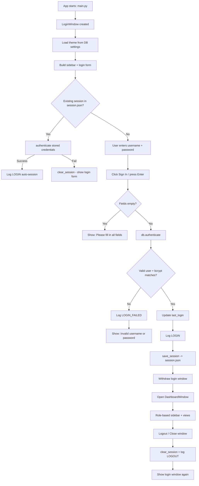

# UAMS — Login Workflow

End-to-end flow for how a user signs into the University Attendance Management System.

## 1. Overview

| Step | Where | What happens |
|---|---|---|
| App launch | `main.py` | Creates `LoginWindow()` and starts the Tk mainloop |
| Theme load | `gui/login.py` `LoginWindow.__init__` | Reads the `theme` setting from DB and applies it |
| UI build | `_build_sidebar()` / `_build_form()` | Renders the branded left panel and the sign-in form |
| Auto login check | `_try_auto_login()` | Restores a previous session from `session.json` if present |
| Manual sign in | `login()` | Validates credentials against the database |
| Post-login | `DashboardWindow` | Opens the role-based dashboard |
| Logout / close | `logout()` / `on_close()` | Clears the session and returns to the login screen |

## 2. Login Flowchart



## 3. Entry Point — `main.py`

```python
app = LoginWindow()
app.mainloop()
```

- Inserts the project root into `sys.path`.
- Creates the `photos/` and `backup/` directories if missing.
- Sets the global CustomTkinter appearance mode to `dark`.

## 4. Startup (`LoginWindow.__init__`)

1. Instantiate `DatabaseManager()` (opens/creates `uams.db`).
2. Read the saved theme with `db.get_setting("theme")` and apply it via `theme.set_mode(...)`.
3. Lay out the window as a 2-column grid:
   - **Column 0** (weight 4) — branded visual sidebar.
   - **Column 1** (weight 5) — the login form.
4. Build both panels and then run `_try_auto_login()`.

### Form controls
- `username_entry` — username field.
- `password_entry` — password field (`show="*"`, Enter key submits).
- `show_password_var` + checkbox — toggles password visibility (`_toggle_password_visibility`).
- `error_label` — fixed-height error text (prevents UI shifting).
- `login_btn` — "Sign In" button bound to `login()`.
- `forgot_link` — opens the reset-password dialog.

### Keyboard shortcuts
- **Enter** in the username field → focuses the password field.
- **Enter** in the password field → calls `login()`.

## 5. Auto-Login (`_try_auto_login`)

Only runs once at startup:

1. `load_session()` reads `session.json` (`{username, password}`).
2. If no session → return (show normal login form).
3. If a session exists → `db.authenticate(session["username"], session["password"])`.
   - Success → log `LOGIN` (auto-session), `withdraw()` the login window, open `DashboardWindow`.
   - Failure (e.g. password changed since) → `clear_session()` and show the form.

## 6. Manual Login (`login()`)

1. Read and strip `username`, read `password`.
2. If either is empty → `error_label = "Please fill in all fields"` and stop.
3. Call `db.authenticate(username, password)`.

### `DatabaseManager.authenticate` (`database/db_manager.py`)

1. `SELECT * FROM users WHERE username=? AND is_active=1`.
   - Inactive accounts cannot log in.
2. `bcrypt.checkpw(password, password_hash)` — verifies the plaintext against the stored hash.
3. On success → update `users.last_login = NOW`, return the user dict.
4. Otherwise return `None`.

### On success
1. Log `LOGIN` to the audit trail (`gui/activity.py` → `activity_logs`).
2. `save_session(username, password)` writes `session.json`.
3. `withdraw()` the login window.
4. Open `DashboardWindow(self, user)`.

### On failure
1. Log `LOGIN_FAILED`.
2. `error_label = "Invalid username or password"`.

## 7. Post-Login — `DashboardWindow`

- Builds a `Sidebar` with navigation items filtered by the user's role (`admin` / `teacher` / `student`).
- `show_frame(name)` destroys the previous frame and instantiates the matching view from the `views` dict.

## 8. Logout / Close

- **Logout button** → log `LOGOUT`, `clear_session()`, destroy the dashboard, redisplay the login window (`apply_theme()` + `deiconify()`).
- **Close window** → same, logging `LOGOUT` via `on_close()`.
- `clear_session()` removes `session.json` so the next launch shows the login form.

## 9. Forgot Password (`forgot_password`)

Opens a "Reset Password" dialog:

1. Enter username + new password (min 4 chars).
2. `db.get_user_by_username(uname)` — if not found, show error.
3. `db.update_user_password(user_id, new_pw)` — hashes with bcrypt and updates.
4. Log `PASSWORD_RESET`, show success, close dialog.

## 10. Key Files

| File | Responsibility |
|---|---|
| `main.py` | Entry point, starts `LoginWindow` |
| `gui/login.py` | Login window UI, validation, auto-login, forgot-password |
| `gui/dashboard.py` | Post-login shell and view routing |
| `gui/sidebar.py` | Role-based navigation |
| `database/db_manager.py` | `authenticate()`, `get_user_by_username()`, `update_user_password()`, `change_password()` |
| `utils/session.py` | `save_session` / `load_session` / `clear_session` (`session.json`) |
| `gui/activity.py` | Audit logging (`LOGIN`, `LOGIN_FAILED`, `LOGOUT`, `PASSWORD_RESET`) |

## 11. Security Notes

- Passwords are stored as **bcrypt hashes** — never plaintext.
- Verification always uses `bcrypt.checkpw`, so the password is never stored or compared in plaintext at the DB layer.
- `session.json` stores credentials in plaintext JSON to enable auto-login (a convenience trade-off; deleting it or a changed password disables auto-login).
- `authenticate()` only returns users where `is_active=1`; disabled accounts are rejected.
