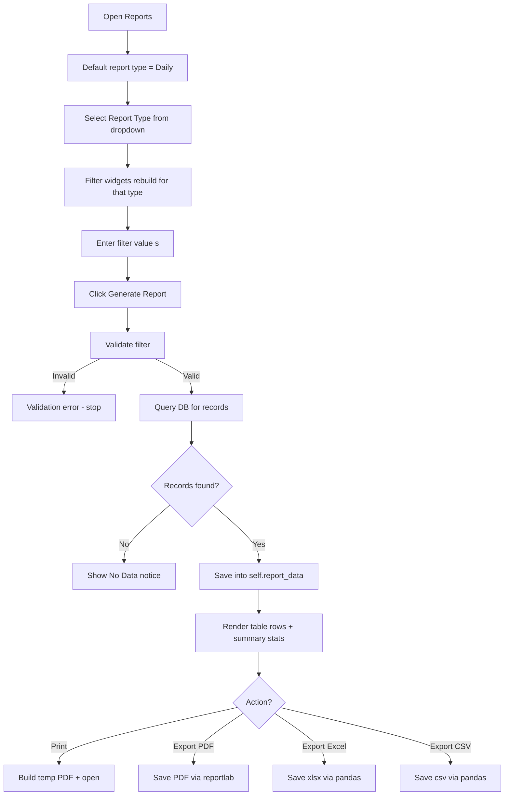

# UAMS — Report Generation Flow

How attendance reports are filtered, generated, displayed, and exported/printed.

## 1. Overview

`ReportsView` (`gui/reports.py`) supports **7 report types**. It loads data into `self.report_data`, renders it in a `ttk.Treeview`, and offers PDF/Excel/CSV export plus print.

| Report type | Filter inputs | Data source |
|---|---|---|
| Daily | date | `get_attendance(attendance_date=date)` |
| Weekly | `YYYY-WW` | `get_attendance(start_date, end_date)` |
| Monthly | year, month | `get_attendance_summary(month, year)` |
| Semester | semester, year | `get_attendance_summary(semester, year)` |
| Student | name/ID | `get_student_attendance_by_course` / summary |
| Teacher | name/ID | `get_teacher_course_stats` / summary |
| Department | department name | `get_department_stats` |

## 2. Flowchart

## 3. Report Generation

`_generate_report()` dispatches by type: `_generate_daily / weekly / monthly / semester / student / teacher / department`.

Every generator follows the same pattern:

1. **Validate** the filter (date format, week `YYYY-WW`, month 1–12, etc.) — invalid input shows an error and stops.
2. **Query** the DB (`db.get_attendance(...)` or a summary method).
3. **No records** → `_show_no_data(message)` shows a "No data" notice in the table.
4. **Records found** → store them in `self.report_data` (a list of dicts).
5. **Render** via `_display_table(headers, col_keys, widths, rows, title)`:
   - Clears the tree, reconfigures columns, inserts rows.
   - Summary stat cards are also refreshed where applicable.

### Filter validation examples
- Daily: date string must be non-empty.
- Weekly: must parse as `YYYY-WW`, e.g. `2026-W31` → computes the week's Monday–Sunday range.
- Monthly: year + month 1–12.
- Semester: semester `1/2/3` + year.

## 4. Export & Print

All export/print actions require `self.report_data` (generated first), otherwise "Generate a report first."

### Print (`print_report`)
- Builds a PDF via **reportlab** (`SimpleDocTemplate` + `Table`), writes it to a temp file, and opens it with `os.startfile`.

### Export PDF (`export_pdf`)
- `filedialog.asksaveasfilename` → reportlab writes a titled table to the chosen `.pdf`.
- Success/error dialogs.

### Export Excel (`export_excel`)
- `pd.DataFrame(self.report_data).to_excel(path, index=False)`.

### Export CSV (`export_csv`)
- `pd.DataFrame(self.report_data).to_csv(path, index=False)`.

> Note: the on-screen table and the exports both use `self.report_data`, so what you export matches what you see.

## 5. Key Files

| File | Responsibility |
|---|---|
| `gui/reports.py` | `ReportsView` — filters, generators, table rendering, export/print |
| `database/db_manager.py` | `get_attendance`, `get_attendance_summary`, `get_student_attendance_by_course`, `get_teacher_course_stats`, `get_department_stats`, and related analytics |
| `gui/attendance_view.py` | Roster-level CSV/Excel export in the take-attendance screen |
| Libs | `reportlab` (PDF), `pandas` + `openpyxl` (Excel), `pandas` (CSV) |
