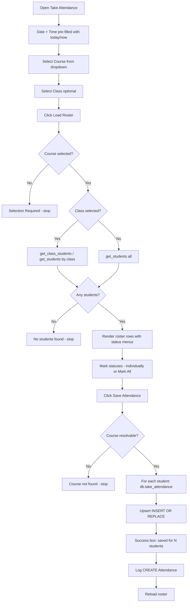

# UAMS — Take Attendance Flow

How a teacher (or admin) records daily attendance for a course/class.

## 1. Overview

The flow runs entirely in `AttendanceTakeView` (`gui/attendance_view.py`) with writes via `db.take_attendance()` (`database/db_manager.py`).

| Step | Where | What happens |
|---|---|---|
| Enter session info | `_build_top_bar` | Date, time, course, class, subject fields |
| Load roster | `load_students()` | Fetch students for the class/course |
| Mark statuses | row option menus + `mark_all()` | Present / Absent / Late / Excused |
| Save | `save_attendance()` | Upsert each student via `take_attendance()` |
| Export (optional) | `export_csv()` / `export_excel()` | Save the in-memory roster to a file |

## 2. Flowchart



## 3. Step Details

### 3.1 Set up the session (`_build_top_bar`)
- **Date** defaults to `date.today()` (`YYYY-MM-DD`).
- **Time** defaults to `datetime.now()` (`HH:MM`).
- **Course** dropdown is populated from `db.get_courses()`.
- **Class** dropdown is populated from `db.get_classes()` (optional).
- **Subject** is auto-filled read-only from the selected course (`_on_course_select`).

### 3.2 Load the roster (`load_students`)
1. Requires a course to be selected.
2. Resolves the roster source:
   - Class selected → `db.get_class_students(class_id)`; falls back to `get_students(class_name=...)` if the class has no enrolled students.
   - No class → `db.get_students()` (all students).
3. Renders one row per student with a `CTkOptionMenu`:
   `["Present", "Absent", "Late", "Excused"]` (default **Present**).
4. Stores each student's `StringVar` in `self.attendance_statuses[student_id]`.

### 3.3 Mark statuses
- Per-row dropdown selection.
- **Mark All Present** / **Mark All Absent** buttons set every `StringVar` at once (`mark_all`).

### 3.4 Save attendance (`save_attendance`)
1. Guards: roster must be loaded, course must be selected and resolvable.
2. Resolves the course ID and optional class ID.
3. Loops over `attendance_statuses` and calls:
   ```python
   db.take_attendance(sid, course_id, attendance_date, status,
                      taken_by=self.user["id"], class_id=class_id)
   ```
4. `take_attendance` uses `INSERT OR REPLACE`:
   - `UNIQUE(student_id, course_id, attendance_date)` means a student/course/date already marked is **overwritten**, so re-saving updates the previous status.
   - Returns `True`/`False`; the count of successes is shown.
5. On completion: success dialog, `log("CREATE", "Attendance", ...)`, then `load_students()` refreshes the roster.

### 3.5 Export (optional)
- Builds a `pandas.DataFrame` from the in-memory roster (`current_students` + current statuses).
- **CSV** → `df.to_csv()`; **Excel** → `df.to_excel()` via `filedialog.asksaveasfilename`.
- Exports the currently displayed (not necessarily saved) data.

## 4. Database — `take_attendance` (`database/db_manager.py`)

```sql
INSERT OR REPLACE INTO attendance
    (student_id, course_id, class_id, attendance_date, attendance_time, status, taken_by)
    VALUES (?, ?, ?, ?, ?, ?, ?)
```

- `attendance_time` is only set when explicitly passed (e.g. by request approval); manual take-attendance passes none.
- A `UNIQUE(student_id, course_id, attendance_date)` constraint makes re-marking idempotent.

## 5. Roles

| Role | Access |
|---|---|
| Teacher | "Take Attendance" nav item → `AttendanceTakeView` |
| Admin | "Attendance Management" → `AttendanceTakeView` |
| Student | No access (view-only via "My Attendance") |

## 6. Key Files

| File | Responsibility |
|---|---|
| `gui/attendance_view.py` | `AttendanceTakeView` — session form, roster, marking, save, export |
| `database/db_manager.py` | `take_attendance()` (upsert), `get_class_students()`, `get_students()`, `get_courses()` |
| `gui/activity.py` | Audit log after saving |
