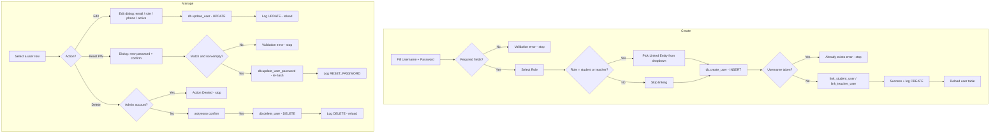

# UAMS — User Account Setup Flow

How admin accounts are created, linked to students/teachers, edited, reset, and deleted.

## 1. Overview

`UserManagementView` (`gui/user_management.py`) is the admin-only screen for accounts. Each login account lives in the `users` table; students/teachers live in their own tables and are **linked** via a `user_id` column so a user can authenticate and see role-specific data.

| Role | Linked entity |
|---|---|
| `admin` | none |
| `teacher` | a row in `teachers` (via `teachers.user_id`) |
| `student` | a row in `students` (via `students.user_id`) |

## 2. Account Lifecycle

## 3. Creating an Account (`add_user`)

1. Read username, password, role, email, phone.
2. Validate username + password are present.
3. `db.create_user(username, password, role, email)`:
   - **bcrypt-hashes** the password (`bcrypt.hashpw(password, bcrypt.gensalt())`).
   - `INSERT INTO users (...)` → returns the new `id` via `lastrowid`.
   - `None` on `sqlite3.IntegrityError` (duplicate username).
4. Optional phone → `db.update_user(user_id, phone=...)`.
5. **Linking** — if a "Linked Entity" was chosen:
   - role `student` → `db.link_student_user(student_id, user_id)` → `UPDATE students SET user_id=?`
   - role `teacher` → `db.link_teacher_user(teacher_id, user_id)` → `UPDATE teachers SET user_id=?`
6. Success dialog, `log("CREATE", "User", ...)`, clear form, `load_users()`.

### Linking dropdown (`on_role_change`)
- Rebuilds `link_map` when the role changes:
  - `student` → `{student_id - full_name: students.id}` from `get_students()`
  - `teacher` → `{teacher_id - full_name: teachers.id}` from `get_teachers()`
  - `admin` → empty

## 4. Editing (`edit_user`)

Dialog with email, role, phone, and **Active** checkbox:

- `db.update_user(uid, email=..., role=..., is_active=...)` and a second call for phone.
- `update_user` uses the **whitelisted columns** pattern — only `{username, email, phone, is_active, role}` can be written.
- `is_active=0` disables the account → `authenticate()` rejects it (`WHERE is_active=1`).
- Log `UPDATE`, reload.

## 5. Resetting a Password (`reset_password`)

- Dialog asks new password + confirm.
- Validations: non-empty, both match.
- `db.update_user_password(uid, new)` → re-hash with bcrypt and `UPDATE users SET password_hash=?`.
- Log `RESET_PASSWORD`. (The same method backs the "Forgot password" flow on the login screen.)

## 6. Deleting (`delete_user`)

- **Admin protection at the GUI layer**: `user["role"] == "admin"` → "Action Denied: Admin accounts cannot be deleted." and stop.
- **DB layer backstop**: `DELETE FROM users WHERE id=? AND role!='admin'`.
- `askyesno` confirmation required.
- Log `DELETE`, reload.

## 7. Login Consequences

| State | Effect at login |
|---|---|
| Account created + linked | Can log in; dashboard shows role-specific nav; student/teacher views resolve the linked profile |
| `is_active=0` | `authenticate()` returns `None` — login blocked |
| Password reset | Old session (`session.json`) no longer validates → auto-login clears it |
| Deleted | Username becomes available again |

## 8. Key Files

| File | Responsibility |
|---|---|
| `gui/user_management.py` | Create/edit/reset/delete UI, role-aware linking dropdown |
| `database/db_manager.py` | `create_user`, `update_user`, `delete_user`, `update_user_password`, `link_student_user`, `link_teacher_user`, `get_users`, `get_user`, `get_user_by_username`, `authenticate` |
| `gui/login.py` | Uses `get_user_by_username`/`update_user_password` in the forgot-password flow |
| `gui/activity.py` | Audit logging (`CREATE` / `UPDATE` / `DELETE` / `RESET_PASSWORD`) |
